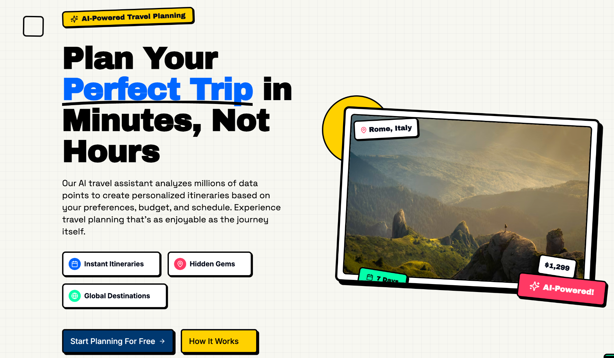

# AI Odyssey Planner



## Overview

AI Odyssey Planner is an intelligent travel planning application that uses AI to create personalized travel itineraries. The platform analyzes millions of data points to recommend destinations, activities, and accommodations based on user preferences, budget constraints, and schedule.

## Key Features

- **AI-Powered Travel Recommendations**: Leverages Claude AI (Anthropic) to generate personalized travel suggestions
- **Interactive Travel Chat**: Real-time conversation with an AI assistant specialized in travel planning
- **Destination Exploration**: Browse and discover curated destinations with detailed information
- **User Authentication**: Secure account creation and management through Supabase
- **Error Monitoring**: Comprehensive error tracking and reporting with Sentry
- **Responsive Design**: Optimized user experience across desktop and mobile devices

## Technologies

### Frontend
- **React**: UI library for building the user interface
- **TypeScript**: Type-safe JavaScript for robust development
- **Tailwind CSS**: Utility-first CSS framework for styling
- **Shadcn/UI**: High-quality UI components for the interface
- **Framer Motion**: Animation library for smooth transitions
- **React Router**: Navigation and routing solution
- **TanStack Query**: Data fetching and state management

### Backend (Serverless)
- **Supabase**: Backend-as-a-Service platform providing:
  - PostgreSQL database for data storage
  - Authentication and user management
  - Edge Functions for serverless API endpoints
  - Row-Level Security for data protection
  - Vector database for semantic search

### AI Integration
- **Anthropic Claude API**: Powers the intelligent travel assistant
  - Natural language conversation capabilities
  - Context-aware travel recommendations
  - Semantic understanding of travel preferences

### Monitoring & Error Tracking
- **Sentry**: Complete application monitoring
  - Real-time error tracking and alerting
  - Performance monitoring
  - User session tracking for debugging
  - Environment-based configuration

## Architecture

The application follows a modern web architecture:

1. **Client-Side Application**: React single-page application (SPA) that handles UI rendering and state management
2. **Serverless Backend**: Supabase for data storage, authentication, and serverless functions
3. **AI Integration**: Edge functions that communicate with Anthropic's Claude API
4. **Monitoring Layer**: Sentry for error tracking and application performance monitoring

## Getting Started

### Prerequisites

- Node.js & npm - [install with nvm](https://github.com/nvm-sh/nvm#installing-and-updating)
- Supabase account
- Anthropic API key
- Sentry account

### Local Development

```sh
# Clone the repository
git clone <REPOSITORY_URL>

# Navigate to the project directory
cd ai-odyssey-planner

# Install dependencies
npm install

# Set up environment variables
# Create a .env file with the necessary API keys and configuration

# Start the development server
npm run dev
```

### Environment Variables

```
VITE_SENTRY_DSN=your_sentry_dsn
VITE_SUPABASE_URL=your_supabase_url
VITE_SUPABASE_ANON_KEY=your_supabase_anon_key
```

### Supabase Edge Functions

For the travel chat functionality, the following environment variables need to be set in the Supabase Edge Functions settings:

- `ANTHROPIC_API_KEY`: Your Anthropic Claude API key
- `SUPABASE_URL`: Your Supabase project URL (set automatically)
- `SUPABASE_SERVICE_ROLE_KEY`: Your Supabase service role key (set automatically)

## Deployment

The application can be deployed using Lovable or any other modern hosting platform:

1. Open [Lovable](https://lovable.dev/projects/e97abad8-b254-431c-9760-a3a96bbd58de) and click on Share -> Publish
2. For custom domains, follow the [Custom Domains documentation](https://docs.lovable.dev/tips-tricks/custom-domain/)

## Error Monitoring with Sentry

The application uses Sentry for comprehensive error tracking:

- Automatic error capturing in all environments
- User identification for context-aware debugging
- Environment-specific configuration
- Debug mode for detailed error information

## Project Structure

```
ai-odyssey-planner/
├── public/                   # Static assets
├── src/
│   ├── components/           # Reusable UI components
│   │   ├── travel/           # Travel-specific components
│   │   └── ui/               # shadcn/ui components
│   ├── contexts/             # React context providers
│   ├── hooks/                # Custom React hooks
│   ├── integrations/         # Third-party integrations
│   │   └── supabase/         # Supabase client and types
│   ├── lib/                  # Utility libraries
│   │   └── sentry.ts         # Sentry configuration
│   └── pages/                # Application pages/routes
├── supabase/                 # Supabase configuration
│   └── functions/            # Edge functions
│       └── travel-chat/      # Travel chat AI assistant
└── index.html                # Entry HTML file
```

## Contributing

1. Fork the repository
2. Create a feature branch
3. Make your changes
4. Submit a pull request

## License

This project is licensed under the MIT License - see the LICENSE file for details.
